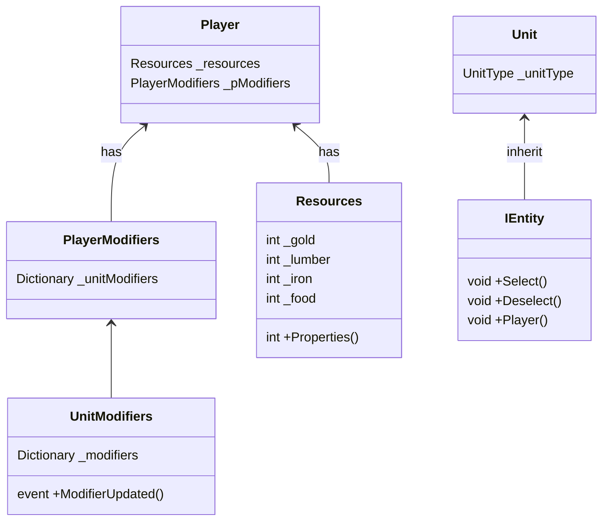

```mermaid
classDiagram

    Player <-- PlayerModifiers: has 
    Player <-- Resources: has 
    PlayerModifiers <-- UnitModifiers

    Unit <-- IEntity : inherit

    PlayerModifiers: Dictionary<Unit, UnitModifiers> _unitModifiers

    Player: Resources _resources
    Player: PlayerModifiers _pModifiers

    UnitModifiers: Dictionary<Modifier, int> _modifiers
    UnitModifiers: event +ModifierUpdated()

    Resources: int _gold
    Resources: int _lumber
    Resources: int _iron
    Resources: int _food
    Resources: int +Properties()

    Unit: UnitType _unitType

    IEntity: void +Select()
    IEntity: void +Deselect()
    IEntity: void +Player()

```